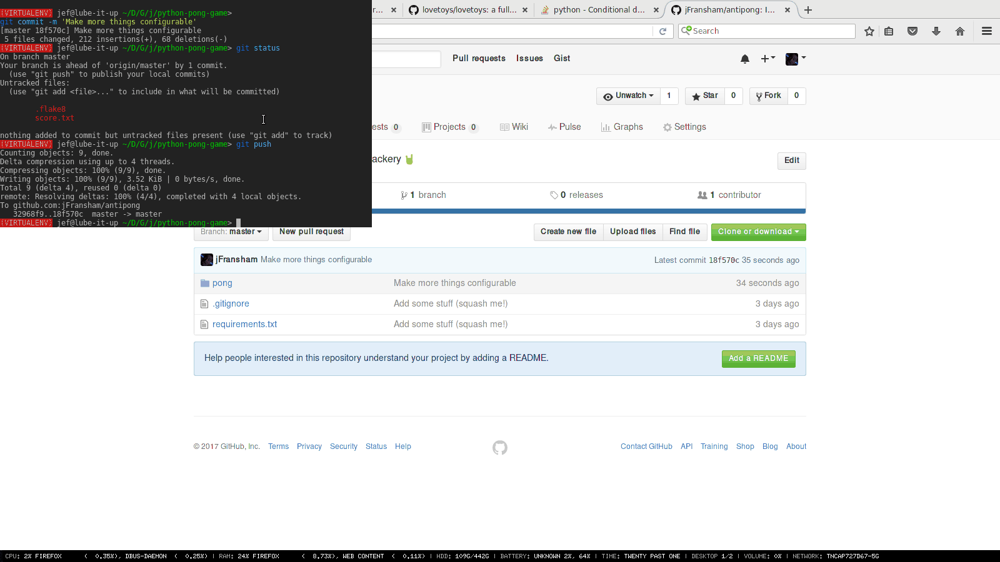

# Antipong

I wrote this as part of a skills test but got totally carried
away with tweaking it around. Works better on Linux because of
an annoying issue with Windows's blocking event loop. If only
`multiprocessing` had a process-aware ring buffer, but alas.

Yeah that's right, for once X11 is the _good_ example of a
windowing system implementation.

To run, use `python2 -m pong`

Anyway, here's a gifje

